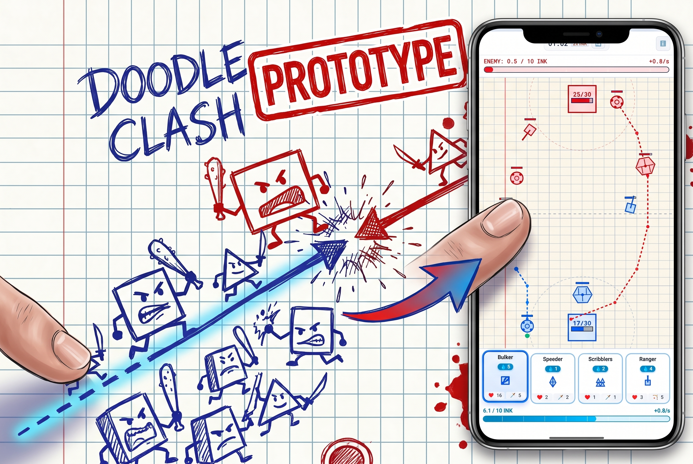
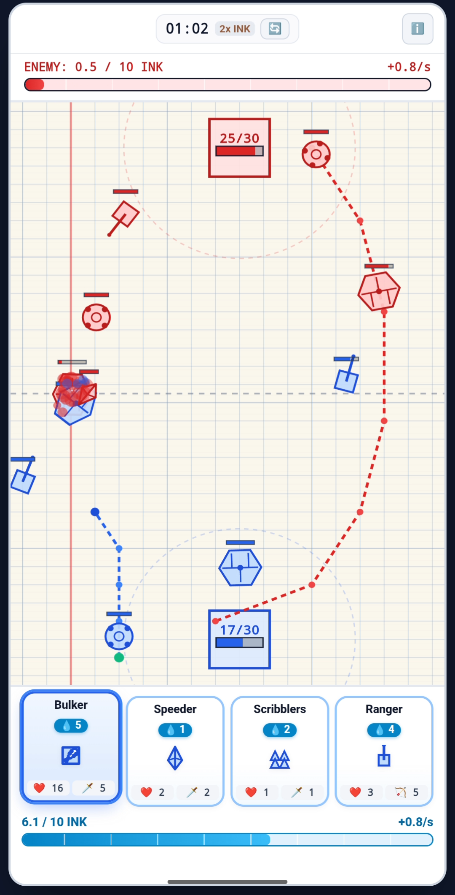
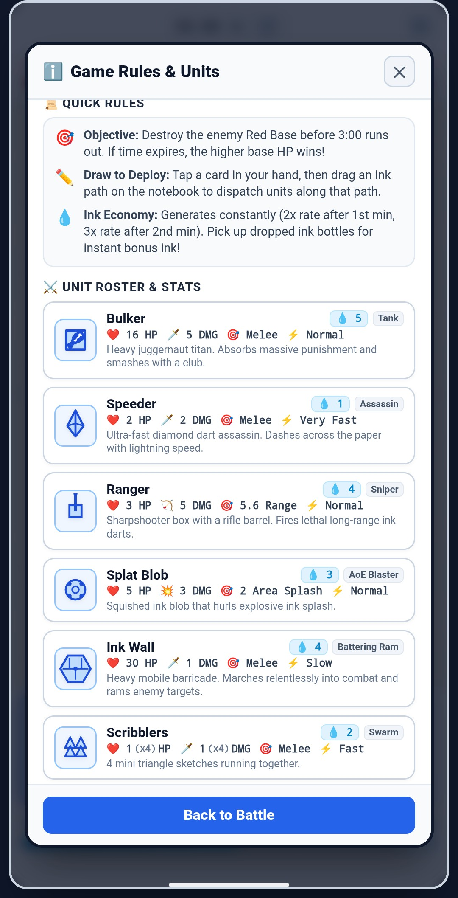

# ✏️ Doodle Clash

**PLAY IT HERE:** [https://pastew.com/doodle-clash-prototype/index.html](https://pastew.com/doodle-clash-prototype/index.html)

A real-time hand-drawn strategy game on squared math notebook paper where players draw ink paths to deploy doodle warriors and assault the enemy fortress.



---

## 🎮 How to Play

1. **Ink & Deck**: Ink regenerates automatically over time, speeding up in the 2nd and 3rd minute of the match (1x / 2x / 3x phases).
2. **Select & Draw**: Select a card from your 4-card hand at the bottom, then click/drag directly on the notebook canvas starting from your baseline to draw a deployment path.
3. **Capture Ink Bottles**: Send units over neutral ink bottles for a random `+1` / `+2` / `+3` ink bonus — whichever team lands the last hit wins the reward.
4. **Destroy the Enemy Fortress**: Guide your army past ink blots and enemy defenders to destroy the Red Fortress before the 3-minute timer expires!

### Units & Roles

| Unit | Cost | Role | HP | Damage | Speed | Attack Range | Detect Range | Attack Speed |
|---|---|---|---|---|---|---|---|---|
| Speeder | 1 | Assassin | 2 | 2 | 5.0 | 1.2 | 3.2 | 0.6 |
| Scribblers | 2 | Swarm (4 units) | 1 each | 1 | 2.6 | 1.1 | 2.8 | 0.6 |
| Splat | 3 | AoE Blaster | 5 | 3 | 1.0 | 3.6 | 3.6 | 1.5 |
| Wall | 4 | Battering Ram | 30 | 1 | 0.7 | 1.2 | 3.0 | 1.5 |
| Ranger | 4 | Sniper | 3 | 5 | 1.1 | 5.6 | 5.6 | 1.8 |
| Bulker | 5 | Tank | 16 | 5 | 1.035 | 1.4 | 3.5 | 1.3 |

*Speed is grid cells/second; Attack Speed is the interval in seconds between attacks (lower = faster). Splat also deals AoE splash damage in a 2.0-cell radius.*

### Screenshots

| In-Match Battle | Game Rules & Units |
|---|---|
|  |  |

---

## 🚀 Running the Game Standalone (Offline / Final Export)

This project is built using **100% unminified Vanilla JavaScript (ES Modules), HTML5 Canvas, and CSS**. No build step, bundler, or compiler is required!

### Option 1: Direct File / Any Static HTTP Server (Recommended)
Because modern browsers require HTTP/HTTPS for ES module imports (`type="module"`), you can run any lightweight local server:
```bash
# Python 3
python -m http.server 8000

# Node.js (npx)
npx serve .

# VS Code
Use the "Live Server" extension on index.html
```
Then navigate to `http://localhost:8000` in any web browser.

---

## 📦 Project Structure

```text
├── index.html              # Main HTML entry point & UI styling
└── src/
    ├── main.js             # Core game loop & application lifecycle
    ├── constants.js        # Grid dimensions, unit balance & card definitions
    ├── systems/
    │   ├── bot.js          # Heuristic AI opponent (strategic lane drawing)
    │   ├── combat.js       # Unit physics, collisions, combat & projectiles
    │   ├── deck.js         # 6-card cycle deck & ink economy engine
    │   ├── input.js        # Pointer/touch gesture path drawing manager
    │   ├── renderer.js     # HTML5 Canvas notebook renderer & animations
    │   └── unitDrawers.js  # Shared unit/card-icon drawing functions
    └── utils/
        ├── audio.js        # Web Audio API procedural sound synthesizer
        └── haptics.js      # Mobile vibration feedback helpers
```

